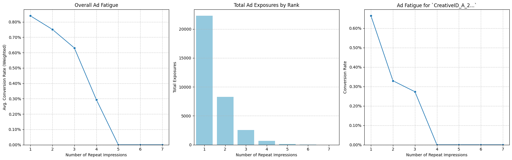

# Cross-Platform (TV & Streaming) Media Attribution Dataset and Analysis (Synthetic)

This repository contains a synthetic dataset designed to simulate the common data challenges encountered in cross-platform media measurement and advertising attribution. The simulated challenges are primarily **identity resolution & mapping**, **cross-platform media attribution**, and **data quality issues**.

## Problems and Analysis

Scroll past this section or click the links to see [motivation](#motivation) and [how to use this repository](#how-to-use-this-repository).

Here are some example problems I attempted.
1. **How much impact does linear and streaming ad impressions have on the amount spent in a purchase?**

In `sql/ads_linked_to_purchases.sql`, I used SQL to assign credit to impressions for each platform with a time-decay model and limited the influence to 30 days before the purchase. The decay was 7-day half-life (1 ad right before purchase = 2 ads 7 days before purchase). This was then fit with a linear regression model with scikit-learn and statsmodels. i.e. the following model equation:

```math
\text{purchase\_value} = \text{Intercept} + (\beta_1 \times \text{decayed\_linear\_tv\_credit}) + (\beta_2 \times \text{decayed\_streaming\_credit})
```

After fitting on a random 80% of the data, we get these coefficients:

```math
\text{purchase\_value} \approx $215.63 + ($65.67 \times \text{decayed\_linear\_tv\_credit}) + (-$0.15 \times \text{decayed\_streaming\_credit})
```

meaning a purchasing customer seeing no ads at all (within 30 days) is predicted to spend $215.63, and seeing 1 ad on linear TV right before the purchase increases their spending by $65.67 wheras 1 ad on over-the-top mediums decreases spending by $0.15.


**Model Evaluation**

With an R-squared of -6%, the model is worse than if just predicted the mean of all purchase values. A different model might be more appropriate, but it also makes sense in the context of this dataset because we generated it using the uniform distribution  independent of ad impressions.

If we did not know the ground truth, we can evaluate the model's assumptions to see where things might've went wrong. The assumptions of a linear regression model using OLS are homoscedasticity, independent and normally distributed errors, and no multicollinearity.



- The top-left plot (Residuals vs Predicted Values) has a random-scatter shape and suggests that the model is homoscedastic since the errors are evenly distributed throughout the range of the predicted values.
- The top-right plot (Q-Q Plot) suggests that the residuals are normally distributed since the points follow a straight line.
- The bottom-left plot (Correlation Matrix) tells us that there is little to no multicollinearity to worry about since the correlations are close to 0.
- The bottom-right plot (Residuals vs. Order) flips flop often between points, which suggests that there shouldn't be a lot of dependence. If they were dependent, we would see clusters of points in positive or negative signs.

2. **Ad Fatigue: Does the influence of an ad on purchases change on repeat impressions to the same user/household?**


Here we can look at various metrics of ad fatigue.
- **What if a company is interested in general advice on maximizing their conversion rate with minimal impressions?**
  
The overall conversion rate of ads in the **first plot** can tell us where the optimum is. This is aggregated from looking at purchases for a specific creative and seeing how many repeated ads that customer has seen for that creative. In this case, it increases at 5 and 6 repeats but the the sample size is much lower (n < 4) for those repeats. With a real-world dataset, we might expect there to be an optimum repeat count in the middle of the range, for example.
- **What if a company cares less about purchases and more about reach and brand awareness for their current campaign?**

In the **second plot**, We can look at how many repeats are happening and suggest appropriate frequency caps on individual id to save on costs.
- Finally, for **companies looking for more specific advice on their own ad creative**.

We can provide the metrics specific to their request (**last plot**) to guide decisions on when to rotate or retire creatives.

If you've seen the dataset generation script, then you know that the PURCHASE_RATE is constant and not dependent on ad_impressions at all. So you might also be wondering why conversion rate is not just a flat line. This is because the lookback window attributes all ads that an individual has seen to the upcoming purchase. Even though it makes sense because people do not just reset their memory after every purchase, it can be misleading. To a naive observer, it may suggest that keeping the campaign running for longer can capture larger and larger percent of the audience when in reality, the audience had a base % to convert (like in our case) and it is pointless to run a campaign at all. To identify this, you would have to assume a base rate of conversion and see if the campaign is converting more compared to that base rate. For example, if we set PURCHASE_RATE to 2% instead of 5%:

## Motivation

In advertising technology and media measurement, data can comes from numerous disparate sources, including linear TV logs, various streaming platforms, website analytics, CRM systems, etc. Linking data points across these sources to understand a user's journey and attribute conversions is a significant challenge. In this dataset, there are inconsistent identifiers, varying data granularities, and data quality issues spread throughout 4 tables: TV, Over-the-top (OTT), Websites, and Purchases. There is also a ground truth identity map with partial coverage of all ids.

## Statistical Distributions Used in Data Generation

This synthetic dataset is not intended to be a statistically accurate reflection of real-world data volumes or distributions but serves to present specific challenges in a manageable format. Here are the primary distributions used: **Bernoulli Distribution** in (ID mapping rates in `sim_id_mapping.csv`), **Uniform Distribution** in (timestamps across logs/visits, purchase values in `sim_purchases.csv`), **Categorical Distribution** in (creative names in `sim_linear_ad_log.csv`), **Discrete Uniform Distribution** in (selecting IDs for log/visit entries, channel/creative IDs, impression counts, entry URLs, purchase timestamp deltas), and sampling with replacement to introduce duplicate logs in `sim_streaming_ad_log_A.csv`.

.csv column details at the end.

## How to Use This Repository

To use this dataset for your project:

1.  **Clone the repository:**
    ```Powershell
    git clone https://github.com/DustinBS/Cross-Platform-Media-Attribution
    cd path/to/Cross-Platform-Media-Attribution
    ```
2.  **Install required Python dependencies:**
    ```Powershell
    pip install -r requirements.txt
    ```
3.  **Generate the synthetic dataset:**
    ```Powershell
    python generate_synthetic_data.py
    ```
    The script will create a `data/` subdirectory and save 5 CSV files (`sim_id_mapping.csv`, `sim_linear_ad_log.csv`, `sim_streaming_ad_log_A.csv`, `sim_website_visits.csv`, `sim_purchases.csv`) within it.

4. **Load into containerized PostgreSQL server (Optional, you will need Docker Desktop for this):**
    ```Powershell
    docker compose up -d
    ```
    This command will start the docker-compose.yml dictating a PostgreSQL database container, which loads the data from the `data/` folder using the `init.sql` script, and maps port 9999 on your computer to the database's default port (5432) inside the container.

    You can then connect to the database using a SQL client (like `psql` or a VS Code database extension) with these details:
    * **Host:** `localhost`
    * **Port:** `9999`
    * **Database:** `TVandAds` (or the name you set in `docker-compose.yml`)
    * **User:** `user` (or the user you set in `docker-compose.yml`)
    * **Password:** `password` (or the password you set in `docker-compose.yml`)

    To stop the database container and remove the data, run `docker compose down -v` in the same directory.

## File Contents (Columns)

Here's a brief overview of the columns in each file. This structure is designed to simulate the fragmented nature of marketing data and the technical hurdles in unifying it for analysis:

**`sim_id_mapping.csv`**
* `simulated_household_id_linear`: ID used in linear data (can be null).
* `simulated_device_id_A`: Device ID used in Streaming App A data (can be null).
* `simulated_user_id_A`: User ID used in Streaming App A data (can be null).
* `simulated_visitor_cookie_id`: Cookie ID used in website data (can be null).

**`sim_linear_ad_log.csv`**
* `linear_airing_id`: Unique identifier for the ad airing event.
* `timestamp_utc`: Timestamp of the ad airing (UTC).
* `linear_channel`: Simulated TV channel.
* `creative_name`: Name of the ad creative (can be null).
* `simulated_household_id_linear`: Household ID exposed to the ad.
* `simulated_impressions`: Number of impressions (typically 1 per household airing).

**`sim_streaming_ad_log_A.csv`**
* `streaming_ad_id_A`: Unique identifier for the streaming ad impression event.
* `timestamp_app_A`: Timestamp of the impression (simulated as UTC).
* `streaming_platform`: Name of the streaming platform ('StreamingApp_A').
* `creative_id_A`: ID of the ad creative on this platform.
* `simulated_device_id_A`: Device ID associated with the impression.
* `simulated_user_id_A`: User ID associated with the impression.
* `simulated_impressions_count`: Number of impressions counted for this log entry (can be > 1).

**`sim_website_visits.csv`**
* `visit_id`: Unique identifier for the website visit.
* `visit_timestamp`: Timestamp of the visit.
* `entry_url`: The URL the user entered the site on.
* `simulated_visitor_cookie_id`: Cookie ID associated with the visit.

**`sim_purchases.csv`**
* `purchase_id`: Unique identifier for the purchase event.
* `purchase_timestamp`: Timestamp of the purchase.
* `purchase_value`: Simulated monetary value of the purchase.
* `simulated_visitor_cookie_id`: Cookie ID associated with the purchase.

## Why Those Columns? (Justification)

This dataset comprises five interconnected CSV files, each simulating data from different sources to present common real-world data integration and quality challenges:

1.  `sim_id_mapping.csv` (Simulated Identity Mapping)
    * **Purpose:** Links identifiers across different simulated systems (Linear TV, Streaming Device, Streaming User, Website Cookie).
    * **Challenge:** Not all individuals have IDs in every system, simulating real-world identity resolution gaps. Nulls indicate missing links.

2.  `sim_linear_ad_log.csv` (Simulated Linear TV Ad Log)
    * **Purpose:** Records simulated ad airings on traditional linear TV.
    * **Challenge:** Uses a household-level identifier (`simulated_household_id_linear`) distinct from digital IDs.
    * **Note:** Includes intentionally **missing `creative_name` values** to simulate data quality issues.

3.  `sim_streaming_ad_log_A.csv` (Simulated Streaming App A Ad Log)
    * **Purpose:** Records simulated ad impressions on a streaming platform.
    * **Challenge:** Uses digital identifiers (`simulated_device_id_A`, `simulated_user_id_A`).
    * **Note:** Includes intentional **duplicate rows** to simulate common logging errors requiring de-duplication.

4.  `sim_website_visits.csv` (Simulated Website Visit Log)
    * **Purpose:** Tracks simulated user activity on an advertiser's website.
    * **Challenge:** Uses a cookie-based identifier (`simulated_visitor_cookie_id`), requiring mapping to link with ad exposure data.

5.  `sim_purchases.csv` (Simulated Purchase Log)
    * **Purpose:** Records simulated conversion events (purchases) occurring on the website.
    * **Challenge:** Linked to website visits and ad exposures via the `simulated_visitor_cookie_id` and temporal proximity, forming the key outcome data for attribution.
